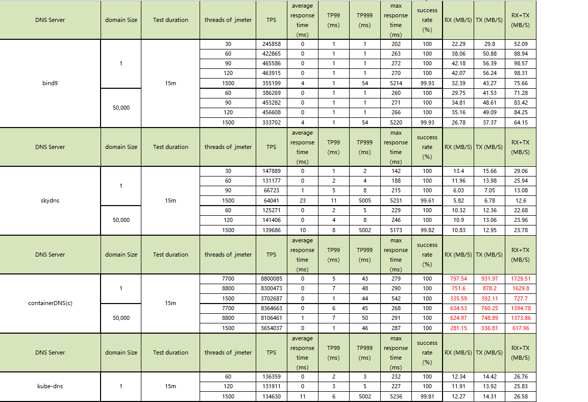

[English](README.md)

# ContainerDNS-C

## 项目简介

 ContainerDNS-C是一个基于DPDK实现的高性能DNS Server服务。服务不依赖数据库，提供restful API 用户可以将数据更新给Server。

## 下载使用

### 1. 下载源码，编译

支持的OS发行版本: Centos-7.2或者Centos-7.4，第一次编译make all，之后可以只编译编译kdns（make kdns）。

```bash
tar -xf kdns.tar.gz
cd kdns
make all
```

### 2. 配置参数，启动服务

ContainerDNS-C 的默认配置文件路径是/etc/kdns/kdns.cfg，配置文件的一个例子如下：

EAL配置参数参考[DPDK文档](http://dpdk.org/doc/guides/testpmd_app_ug/run_app.html#eal-command-line-options).

```vim
[EAL]
cores = 1,3,5,7
memory = 1024,1024
mem-channels = 4
 
[NETDEV]
; 默认KNI网口名称
name-prefix = kdns
mode = rss
mbuf-num = 50000
kni-mbuf-num = 10000

rxqueue-len = 1024
txqueue-len = 2048
    
rxqueue-num = 4
txqueue-num = 5

; KNI网口IP地址
kni-ipv4 = 2.2.2.240
; BGP 发布的VIP
kni-vip = 10.17.9.100

[COMMON]

log-file = /export/log/kdns/kdns.log
fwd-def-addrs = 114.114.114.114:53,8.8.8.8:53
fwd-thread-num = 4
web-port = 5500
ssl-enable = no
cert-pem-file = /etc/kdns/server1.pem
key-pem-file = /etc/kdns/server1-key.pem
zones = tst.local,example.com
```

配置hugepage:

```bash
echo 4096 > /sys/kernel/mm/hugepages/hugepages-2048kB/nr_hugepages
```

加载[IGB_UIO](http://dpdk.org/doc/guides/linux_gsg/linux_drivers.html)模块，为网卡绑定用户态驱动igb_uio：

```bash
modprobe uio
insmod ./bin/igb_uio.ko
./bin/dpdk-devbind.py --bind=igb_uio kdns
```

加载[KNI](http://dpdk.org/doc/guides/linux_gsg/enable_func.html#loading-the-dpdk-kni-kernel-module)模块:

```bash
insmod ./bin/rte_kni.ko
```

启动kdns进程:

```bash
./bin/kdns 
```

## Api 介绍

### 1. 增加域名数据

```bash
curl -H "Content-Type:application/json;charset=UTF-8" -X POST -d '{"type":"A","zoneName":"example.com","domainName":"chen.example.com","host":"192.168.2.2"}'  'http://127.0.0.1:5500/kdns/domain' 

curl -H "Content-Type:application/json;charset=UTF-8" -X POST -d '{"type":"CNAME","zoneName":"example.com","domainName":"chen.cname.example.com","host":"chen.example.com"}' 'http://127.0.0.1:5500/kdns/domain' 

curl -H "Content-Type:application/json;charset=UTF-8" -X POST -d '{"type":"SRV","zoneName":"example.com","domainName":"_srvtcp._tcp.example.com","host":"chen.example.com","priority":20,"weight":50,"port":8800}'  'http://127.0.0.1:5500/kdns/domain'
```

### 2. 查询域名信息

```bash
curl -H "Content-Type:application/json;charset=UTF-8" -X GET   'http://127.0.0.1:5500/kdns/perdomain/chen.example.com' 
curl -H "Content-Type:application/json;charset=UTF-8" -X GET   'http://127.0.0.1:5500/kdns/domain' 
```

### 3. 查看统计信息

```bash
curl -H "Content-Type:application/json;charset=UTF-8" -X GET   'http://127.0.0.1:5500/kdns/statistics/get'
```

## 性能数据

CPU型号: Intel(R) Xeon(R) CPU E5-2698 v4 @ 2.20GHz

网卡型号: Intel Corporation 82599ES 10-Gigabit SFI/SFP+ Network Connection

Jmeter version: apache-jmeter-3.1

测试样本： 单个域名 kubernetes.default.svc.skydns.local（10.0.0.1）
           5万域名 skydns.local后缀，域名随机。其中三万个一个IP，一万个2个IP，一万个3-10个IP地址（随机）。
           
  测试过程jmeter一次读取要测试的域名及IP对应关系，发送DNS请求，并解码DNS Server返回的结果，判断返回的结果是否是域名对应的IP。

结果如下：


